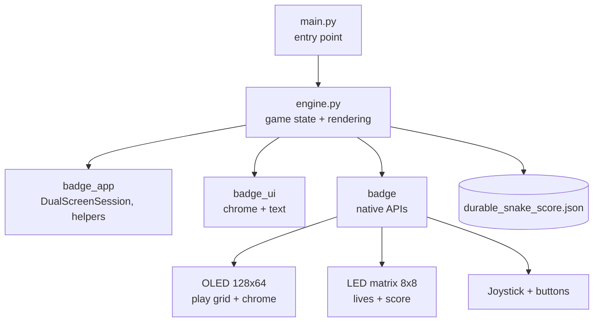

# Durable Snake

A snake game for the Temporal Replay Badge — a custom
MicroPython app that lets you grow long, die fast,
and continue from where you fell thanks to three
built-in retries. Inspired by Temporal's durable
execution mantra.

[](LICENSE)

https://github.com/user-attachments/assets/f2cd3311-fb24-43c2-9589-72fddf574083

## Features

- **Three lives per run** — a snake bite is not the
  end. Two retries let you continue at full speed
  with your score intact.
- **Geometric speedup** — the play interval shrinks
  by ~7.7% per apple eaten, from 170 ms down to a
  38 ms floor. Reaching score 20 already feels
  brutal.
- **Dual-screen output** — the OLED runs the game
  grid; the 8×8 LED matrix shows lives on the top
  row and score progression on the rest.
- **Visual effects** — eat-burst rings, milestone
  flashes every 10 apples (hardware OLED invert plus
  LED strobe), animated death sequence, animated
  title and game-over screens.
- **Audio and haptics** — coil-tone beeps on every
  apple, descending tone on death, vibration on game
  over.
- **Persistent best score** — saved to flash on the
  badge, survives reboots and reflashes that keep
  the filesystem.

## Prerequisites

- A **Temporal Replay Badge** (ESP32-S3) running
  MicroPython 1.27.0 or later, connected over USB.
- **`mpremote`** 1.27.0 or later on your host
  machine (`brew install mpremote` or
  `pipx install mpremote`).
- The badge's standard libraries (`badge`,
  `badge_app`, `badge_ui`) — pre-installed on
  Temporal-issued badges.

## Getting Started

Clone the repo and deploy the two app files to the
badge:

```bash
git clone https://github.com/<owner>/durable-snake.git
cd durable-snake

# Find the badge's serial port
mpremote devs

# Create the app folder and copy the source
PORT=/dev/cu.usbmodem2101
mpremote connect "$PORT" resume mkdir :apps/durable_snake
mpremote connect "$PORT" resume cp \
    app/engine.py :apps/durable_snake/engine.py
mpremote connect "$PORT" resume cp \
    app/main.py :apps/durable_snake/main.py
```

> **Note** — always use `resume` with this badge.
> The firmware does not emit `soft reboot` after
> Ctrl-D, so the default `mpremote connect ...` mode
> fails to enter raw REPL.

Once deployed, launch the app from the badge's
**Apps** menu and pick **durable_snake**.

## Usage

Controls during play:

| Input                      | Action                    |
| -------------------------- | ------------------------- |
| Joystick (4 ways)          | Steer the snake           |
| `BTN_BACK`                 | Quit the current run      |
| `BTN_CONFIRM` / `BTN_BACK` | Confirm / cancel on menus |

A 1-pixel border surrounds the play field — touching
it ends the life. When you bite yourself or hit the
wall with lives remaining, a **Bitten!** screen
offers a retry; otherwise the run ends and your
score is recorded.

The best score is saved at
`/durable_snake_score.json` on the badge filesystem.

## Architecture



The play grid is 31 columns × 13 rows of 4×4-pixel
cells, framed by a 1-pixel border just below the
chrome header. The LED matrix's top row lights one
cell per remaining life; the seven rows below fill
in raster order with one cell per apple, looping
with a brightness boost every 56 apples.

## Contributing

This is a personal project, but bug reports and
small patches are welcome through GitHub issues
and pull requests. Please match the existing code
style (no decorative comments, short docstrings,
descriptive identifiers over prose).

## License

This project is licensed under the Apache-2.0
License — see [LICENSE](LICENSE) for details.
