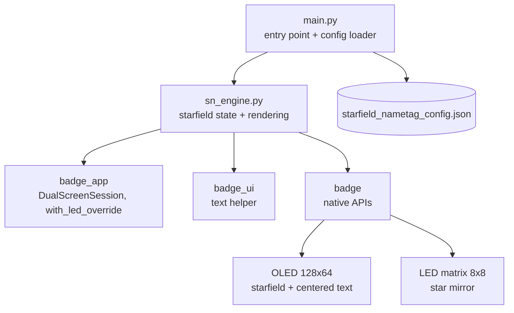

# Starfield Nametag

An animated starfield for the Temporal Replay Badge —
a MicroPython app that renders a perspective
star-flight on the OLED with a configurable nametag
text frozen at the center, mirrored on the 8×8 LED
matrix. A small piece of ambient sci-fi for the
badge, ideal for a conference nametag or event
tagline display.

## Features

- **Perspective starfield** — stars accelerate
  outward from the center of the OLED on a
  multiplicative growth curve, switching from a
  single pixel, to a 2×1 streak, to a 2×2 block as
  they pass the camera. Recycled at the origin when
  they leave the screen.
- **Configurable centered text** — a fixed message
  sits in a punched halo at the middle of the OLED
  so it stays readable over the moving field. Set
  the default in `main.py`, or override at runtime
  with a JSON file on the badge filesystem.
- **LED matrix mirror** — eight independent stars
  drift outward across the 8×8 RGB matrix, fading
  in with distance, reinforcing the space motif
  without competing with the OLED.
- **Folder-app conventions** — installs as a
  standard `apps/starfield_nametag/` entry in the
  badge menu, exits cleanly on the back button, and
  restores the display state on cleanup.

## Deploying

```bash
PORT=/dev/cu.usbmodem2101  # whatever mpremote devs reports
mpremote connect "$PORT" resume mkdir :apps/starfield_nametag
mpremote connect "$PORT" resume cp \
    apps/starfield_nametag/sn_engine.py :apps/starfield_nametag/sn_engine.py
mpremote connect "$PORT" resume cp \
    apps/starfield_nametag/main.py   :apps/starfield_nametag/main.py
```

Hard-reset the badge after deploying, then launch
**starfield_nametag** from the **Apps** menu.

## Configuring the nametag text

The default text is set in `main.py` via the `TEXT`
constant. To override at runtime without
re-deploying source, drop a JSON file at
`/starfield_nametag_config.json` on the badge
filesystem:

```json
{ "text": "Replay 2026" }
```

If the file is missing or malformed, the constant is
used as a fallback. Keep the message short —
roughly 18 characters fit horizontally at the
OLED's pixel font (6 px per glyph over a 128 px
display).

## Controls

The app is non-interactive — once launched, the
starfield runs until you exit.

| Input      | Action                     |
| ---------- | -------------------------- |
| `BTN_BACK` | Quit back to the apps menu |

## Architecture



The OLED renders 36 stars on a polar coordinate
system anchored at `(64, 32)`. Each frame multiplies
each star's radius by `1.06`, projects it back to
Cartesian, draws a shape sized by distance, and
recycles stars that leave the screen. The text
glyphs are drawn last, after punching a black halo
in the underlying buffer so the message stays
crisp. The LED matrix runs an independent eight-star
field with `1.10` growth and brightness ramped by
distance from center.
